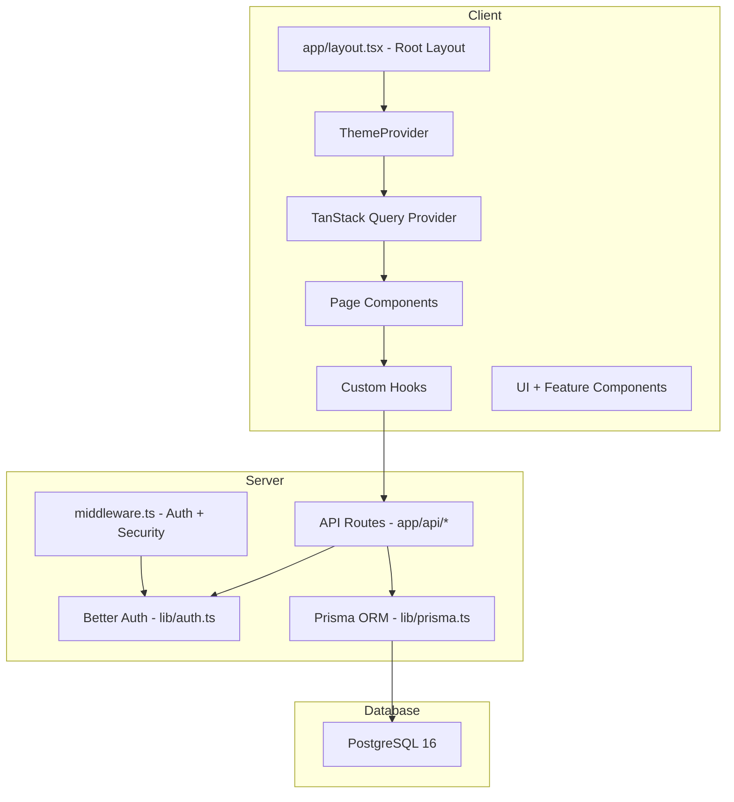

<!-- generated-by: gsd-doc-writer -->

# Architecture

## System Overview

Moodscaparr is a single-page web application built with Next.js 16 (App Router) and React 19. The app follows a server-client architecture where Next.js handles server-side rendering, API routing, and middleware, while the browser handles client-side interactivity, state management, and chart rendering. Data is persisted in PostgreSQL 16 via Prisma 7 ORM with the `@prisma/adapter-pg` connection pool adapter.

## Data Flow

A typical request follows this path:

1. **Browser** → sends HTTP request to Next.js server
2. **Next.js middleware** (`middleware.ts`) → checks session auth, redirects unauthenticated users to `/auth/login`, enforces admin role for `/admin/*` routes, sets security headers
3. **Next.js App Router** → renders the matching page (SSR or client-side)
4. **Client component** → fetches data via TanStack Query hooks (`hooks/use-*.ts`) which call API routes at `app/api/*`
5. **API route** → reads/writes to PostgreSQL via Prisma client (`lib/prisma.ts`), returns JSON
6. **TanStack Query** → caches response, re-renders components with new data

```
Browser → Middleware → App Router → [Page Component]
                                       ↓
                                  TanStack Query
                                       ↓
                                  API Route
                                       ↓
                                  Prisma + PostgreSQL
```

## Component Diagram



## Directory Structure

```
app/              — Next.js App Router pages and API routes
  api/              — REST API route handlers (achievements, admin, analytics, auth, mood-entries, etc.)
  auth/             — Login, register, password reset pages
  dashboard/        — Main dashboard page
  wizard/           — Mood logging wizard
  history/          — Entry history with search/filter
  calendar/         — Calendar heatmap
  analytics/        — Analytics and charts
  achievements/     — Achievement badges
  admin/            — Admin panel (user management, SSO, invite codes)
  settings/         — User profile and settings

components/       — Reusable React components
  ui/               — Base UI primitives (button, card, dialog, etc.) from shadcn/ui
  wizard/           — Mood logging wizard components
  history/          — Entry list, filters, search, CSV export
  calendar/         — Calendar heatmap and color legend
  analytics/        — Overview, trends, reflections tabs
  achievements/     — Achievement cards, lists, unlock toast
  admin/            — Dashboard, user table, invite codes, SSO config
  settings/         — Profile form, data export/import
  feedback/         — FAB button and feedback dialog
  onboarding/       — Onboarding tour

hooks/            — Custom React hooks (TanStack Query wrappers)
lib/              — Core library code
  auth.ts           — Better Auth server configuration
  auth-client.ts    — Better Auth client configuration
  prisma.ts         — Prisma client singleton with pg adapter
  query-client.ts   — TanStack Query client factory
  rate-limit.ts     — In-memory rate limiter
  utils.ts          — Shared utility functions
  stats.ts          — Stats calculation
  achievements.ts   — Achievement logic

prisma/           — Database schema and migrations
types/            — TypeScript type definitions
  mood.ts           — Mood entry types, constants (moods, activities, weather)
  achievements.ts   — Achievement types
```

## Key Abstractions

| Abstraction | Location | Purpose |
|-------------|----------|---------|
| PrismaClient singleton | `lib/prisma.ts` | Global database client with connection pooling (`@prisma/adapter-pg`) |
| Better Auth server | `lib/auth.ts` | Auth configuration, admin plugin, first-user-as-admin hook |
| TanStack Query client | `lib/query-client.ts` | Query client with SSR support, 60s stale time |
| Rate limiter | `lib/rate-limit.ts` | In-memory sliding window rate limiter |
| Middleware guard | `middleware.ts` | Auth session check + admin role guard + security headers |
| Mood selectors | `components/ui/mood-selector.tsx` | Shared mood category picker used by wizard and quick-log |
| Wizard provider | `components/wizard/wizard-provider.tsx` | Multi-step wizard state management |
| Providers wrapper | `components/providers.tsx` | TanStack Query provider injection |

## Database Model

The Prisma schema defines 9 models: `User`, `Session`, `Account`, `Verification`, `MoodEntry`, `UserProfile`, `Achievement`, `InviteCode`, `SsoProvider`. The primary entity is `MoodEntry` which stores the user's mood with all context data (category, intensity, activities, weather, sleep, energy, stress, reflection prompts).
